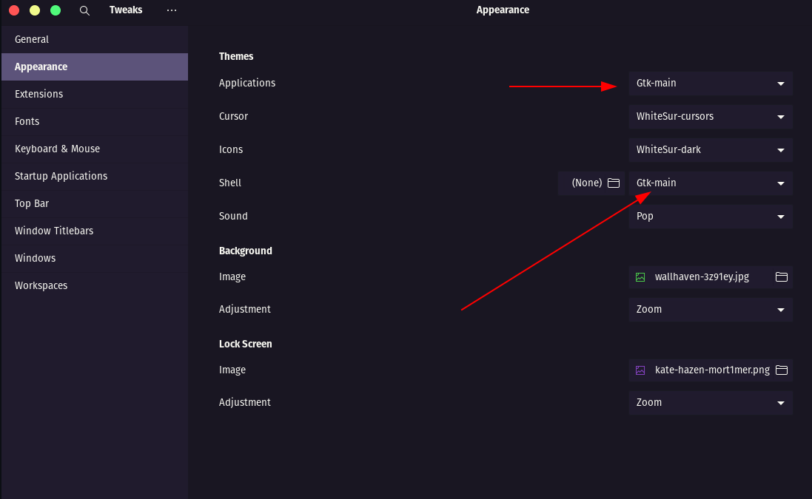

### [GTK](https://www.gtk.org/)

#### Install manually

Download using the [GitHub.zip download](https://github.com/getomni/gtk/archive/main.zip) option and extract the `.zip` file to the themes directory i.e. `~/.themes/` or `/usr/share/themes/` (create folders it if necessary).
#### Activating theme

You can use `Gnome Tweaks` to activate the theme.

```bash
sudo apt install gnome-tweak-tool
```

or 

```bash
sudo apt install gnome-tweaks
```
* After this, search for Gnome Tweaks in yours applications
* Open Gnome Tweaks and go to `Appearance`
* Select `Gtk-main` and the theme will be applied
* If you want the shell to look the same as the theme, you need to install the [User theme extension](https://extensions.gnome.org/extension/19/user-themes/) and activate it in `Gnome Tweaks` then as in the image below.

<p align="center">
  
</p>
