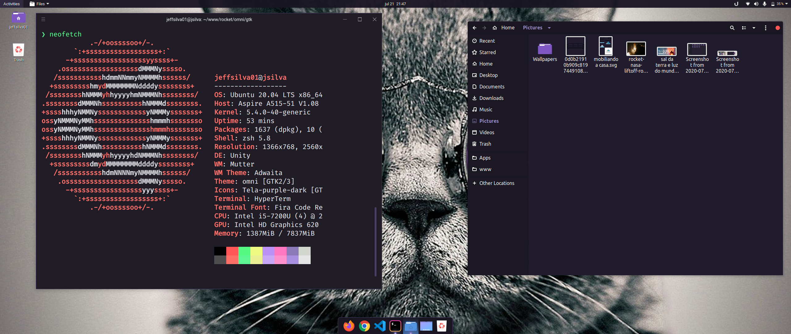

# Omni for [GTK](https://www.gtk.org/)

> A dark theme for [GTK](https://www.gtk.org/).

This theme provides support for GTK-3 and GTK-2 based desktop environments like Gnome, Unity, Budgie, Pantheon, XFCE, Mate, etc.

## License

[GPL-3.0 License](./LICENSE)

### Notes:
* This theme is based on the [Dracula-gtk-theme](https://draculatheme.com/gtk).
* Icon theme in the screenshot is [Tela-purple-dark](https://www.gnome-look.org/p/1279924/).