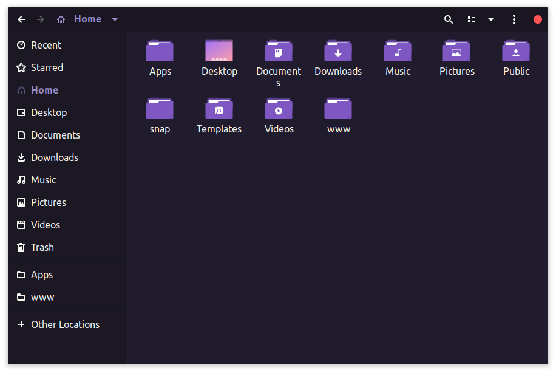

<h1 align="center">
   
  
   
  Omni for <a href="https://www.gtk.org/">GTK</a>
   
</h1>

  <strong>Dark theme for <a href="https://www.gtk.org/">GTK</a></strong>

  

  

  <a href="#install">Install</a> •
  <a href="#team">Team</a> •
  <a href="#license">License</a>

  

This theme provides support for GTK-3 and GTK-2 based desktop environments like Gnome, Unity, Budgie, Pantheon, XFCE, Mate, etc.

## Install

All instructions can be found at [INSTALL.md](./INSTALL.md).

## Team

This theme is maintained by the following person(s) and a bunch of [awesome contributors](https://github.com/getomni/gtk/graphs/contributors).

|  |
| ------------------------------------------------------------------------------------------------- |
| [Jefferson Silva](https://github.com/JeffSilva01)                                                 |

## License

[GPL-3.0 License](./LICENSE.md)

---

Special thanks for the [Dracula GTK theme](https://draculatheme.com/gtk) for making this possible.
